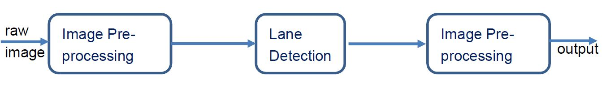
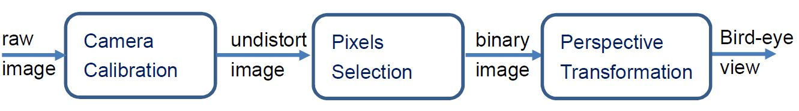
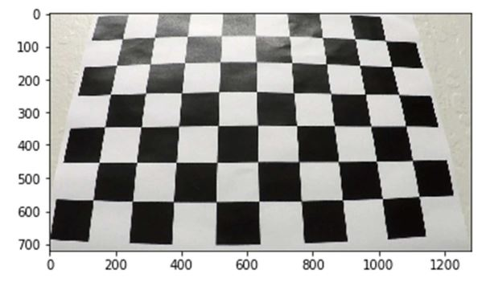
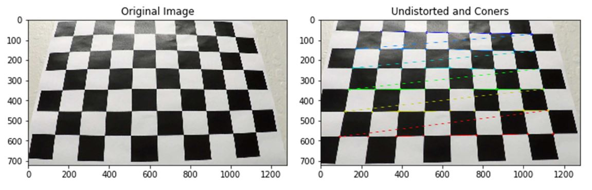
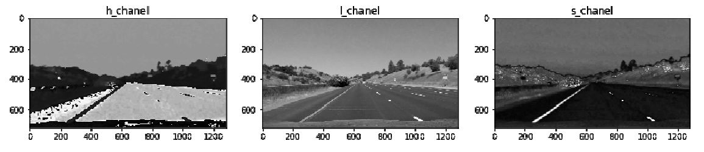

# Udacity-CarND-Advanced-Lane-Lines
  
This project was developed on windows 10 with Anaconda, jupyter notebook installed.  

## Dependencies  
* matplotlib  
* opencv
* numpy
* glob

## 1. Image Process Pipeline
  

## 2. Image Pre-Process Pipeline
  

### 2.1 Camera Calibration  
The purpose of camera calibration is to eliminate to image distortion caused by
physical installation error of camera mounting position or by unparallel camera
lens.  

Chessboard is introduced here for performing calibration. By applying
'cv2.findChessboardCorners', precise corner position can be pinpointed.
This function requires input of number of points in each row and column. For
example, image below has 9 points each low and 6 points each column.  

It is also essential to obtain destination point indices before calculating
reverse-distortion matrix. Function *cv2.calibrateCamera* calculates matrices
for undistortion. Last step is cv2.undistort to undistort raw image.  

### 2.2 Pixel Selection
#### 2.2.1 Sobel
Multiple methods are candidates for keeping image Pixels. Instead of general
Canny edge detection, Sobel methods can provide gray scale derivative in
specific situation.  

#### 2.2.2 HLS Color Space
In addition to Sobel, HLS color space is also taking into consideration that it
provide useful information regardless strength of lightness.

## Line Extrapolation  
 

## Shortcoming  
While extrapolating lines, only slope are considered as threshold to
categorized points set into left or right group. Which means the outputs can be
sever influence by road signs, cars ahead and split lane lines or any objects
with edges can pass Hough transformation criteria.
