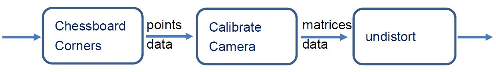
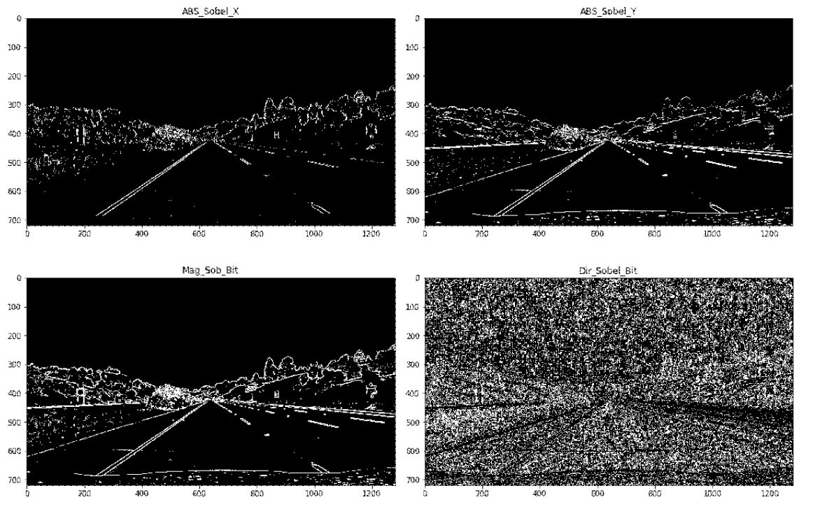
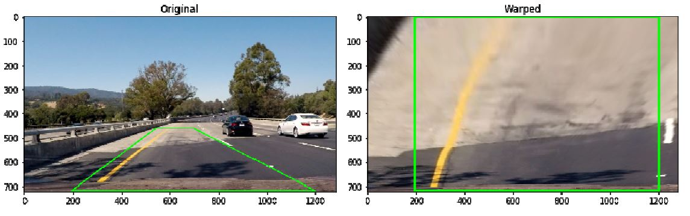
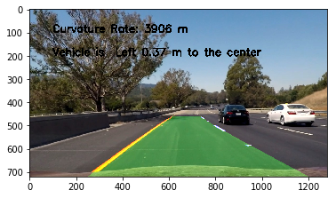

# Udacity-CarND-Advanced-Lane-Lines
  
This project was developed on windows 10 with Anaconda, jupyter notebook installed.  

## Dependencies  
* matplotlib  
* opencv
* numpy
* glob

## 1. Image Process Pipeline
  

## 2. Image Pre-Process Pipeline
  

### 2.1 Camera Calibration  
The purpose of camera calibration is to eliminate to image distortion caused by
physical installation error of camera mounting position or by unparallel camera
lens.  

Chessboard is introduced here for performing calibration. By applying
'cv2.findChessboardCorners', precise corner position can be pinpointed.
This function requires input of number of points in each row and column. For
example, image below has 9 points each low and 6 points each column.  
  
It is also essential to obtain destination point indices before calculating
reverse-distortion matrix. Function *cv2.calibrateCamera* calculates matrices
for undistortion. Last step is cv2.undistort to undistort raw image.  



### 2.2 Pixel Selection
#### 2.2.1 Sobel
Multiple methods are candidates for keeping image Pixels. Instead of general
Canny edge detection, Sobel methods can provide gray scale derivative in
specific situation.  


#### 2.2.2 HLS Color Space
In addition to Sobel, HLS color space is also taking into consideration that it
provide useful information regardless strength of lightness.  


#### 2.2.3 HLS_S Channel and Sobel X
After examining results multiple methods, binary images filtered from HLS s
channel and from sobel absolute x can provide distinctive lane pixels. Final
decision is to add up these images together for preserve maximum points data
for polynomial calculation.  


### 2.3 Perspective Transformation
In order to perform transformation, source point and destination point are
essential for function cv2.getPerspectiveTransform(src, dst) to retrieve
transformation matrix. In order to determine these points, HoughLinesP can
offer straight lines and end points position. To provide noise free data for
HoughLinesP, manually select region of interest.  

Input data used here is absolute sobel x, whose capability of providing lane
contour can create decisive straight line.  

#### 2.3.1 Left and Right side ROI
    
Right and left region of interest are separately picked to keep the function’s line
number as small as possible. Function Get_Source_Points(Binary_image,
mask_points, top_y_coornate) performs HoughLinesP averaging line and
extrapolate line to calculate end points.  

#### 2.3.2 DST Points Selection
  
In image above green polygon shows four source points at four corners.
Easiest way is to use red intersections as upper part destination points.
Perspective transformation result is shown in next page.  

#### 2.3.3 Perspective Transformation
Now src and dst data are available, transformation matrix can be access by:
``M = cv2.getPerspectiveTransform(src, dst)`` , switch src and dst, inverse
transformation matrix is also calculated.
``Inv_M = cv2.getPerspectiveTransform(dst, src)``
To warp an image, use following function:
``output = cv2.warpPerspective( img, M, (width , height ) )``

#### 2.3.3.1 Transformation result

Figure above shows transformation result on straight lane, both left and right
lane lines are shown clearly in the picture. However, when testing this on curve,
as shown in picture below, a large portion of right hand side lane is not
included. This will lead to problems while collecting pixels.  

A little tweak on dst points can successfully address this issue. Below are
original and modified code. 

##### Originel:
```
src = np.float32([ left_up, right_up, right_down, left_down, ])
dst = np.float32([ [left_down [0] ,0 ],
                   [right_down[0] ,0],
                   [right_down[0] , right_down[1]],
                   [left_down[0] , left_down[1]] ])

```  
##### Modified
```
offset = 150
src = np.float32([ left_up, right_up, right_down, left_down, ])
dst = np.float32([ [left_down [0] + offset ,0 ],
                   [right_down[0] - offset ,0 ],
                   [right_down[0] – offset , right_down[1]],
                   [left_down [0] + offset , left_down[1]] ])

```

Warp image with offset dst points is show in the next page. Right lane line
which is previous excluded is now inside image.


## 3. Lane Detection


### 3.1 Sliding Window
As show in the chart above, if a new image goes through lane detection
algorithm, this image will be convolved and then the peak is where the most
likely position for the lane marker  

First version of convolve algorithm is like introduced in lesson as shown below:  
```
l_center = np.argmax(conv_signal[l_min_index:l_max_index])+l_min_index-offset
```
Visualized output is shown in next page.  
  
While zero points are undergone convolve, next center output subtract offset
nevertheless. It’s more reasonable to presume the next center x location
remains the same since most lane line is continuous.  
Here, a threshold and condition are added to code.  
```
if conv_signal[np.argmax(conv_signal[l_min_index:l_max_index])+l_min_index]
<= thresh:
l_center = l_center
else:
l_center =
np.argmax(conv_signal[l_min_index:l_max_index])+l_min_index-offset
```
Visualized output is shown below.  


### 3.2 Mark Line Pixels
In this part, pixels in windows as shown in previous picture are select and
colored.  


### 3.3 Polynomial coefficient, Radius, Center
When left and right lane line pixels are separately isolated, these data are used
to calculated polynomial coefficient. Once coefficients are available, curvature
rate and road center can be computed.  


### 3.4 Search around Polynomial
Once polynomial coefficients are calculated, search for lane pixels can be
more efficient by offset left lane line and focuses on pixels fall in the region.
This is useful while processing videos.  


## 4. Image Post-processing
Last step is to reverse the warped image and add visualized lane data along
with curvature rate and vehicle center position on raw image input.  


